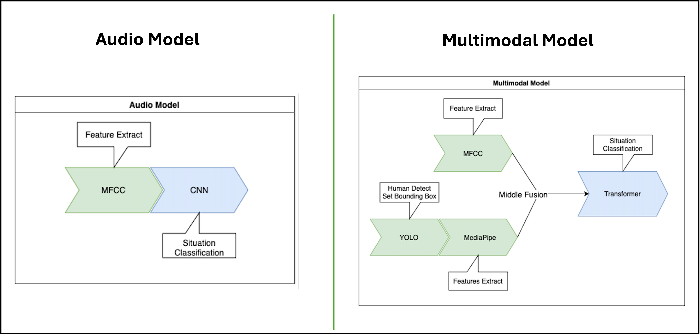

# Silver Assistant Project

## 문제 인식
- 고령화가 심해지며 노인돌봄 서비스 수요가 많아지고 있으나 AI를 활용한 노인 맞춤 서비스는 부족함
- 특히 노인의 주요 사망 원인인 낙상과 갈수록 증가하는 노인 대상 범죄(학대, 폭력 등), 빠르게 증가하고 있는 고독사 문제를 해결하는 것은 고령화 사회에서 해결해야 할 시급한 문제임

## 프로젝트 개요
- **Silver Assistant**는 **멀티모달 AI**를 통한 정확도 높은 **위험 상황 감지**와 **프라이버시 중심** 설계를 바탕으로 기술적 차별화를 확보하였으며, 활동성 데이터 기반의 통계 제공 및 건강 유도 시스템을 통해 독거노인의 **삶의 질 향상**에 기여할 수 있음
- 향후 의료기관이나 복지센터 등 다양한 분야로의 **확장 가능성**을 보유하고 있으며, IoT 디바이스 연계를 통해 스마트 홈 서비스로 발전할 가능성도 열려 있음

- **프라이버시 중심 설계**
   - 기존 홈캠과 달리 24시간 녹화가 아닌 음성 모델을 통해 의심 상황을 실시간으로 탐지하고, 필요 시에만 홈캠을 활성화하여 사용자의 프라이버시를 최대한 보호
   - 이러한 방식은 노인과 보호자가 가지는 프라이버시 침해에 대한 우려를 해결함과 동시에 신속하고 정확한 위기 대응을 가능
- **멀티모달 AI 기술의 혁신적 활용**
   - 음성과 영상 데이터를 함께 분석하는 중기융합 멀티모달 기술을 통해 낙상과 범죄 같은 위급 상황을 고도로 정확하게 감지
   - 음성 기반으로 첫 번째 위험 신호를 감지한 뒤, 필요한 경우 카메라를 활성화하여 영상을 추가적으로 학습함으로써 단일 데이터 소스보다 훨씬 높은 신뢰성과 정밀도를 제공
- **활동성 분석으로 사고 예방**
   - 고령자의 움직임 데이터를 주기적으로 분석하여 활동성 감소를 조기에 감지하고, 보호자 및 복지기관에 경고를 전송함으로써 사고와 고독사를 예방
   - 활동성 데이터를 기반으로 노인의 건강 상태와 행동 변화를 파악하고, 이를 보호자와 복지기관이 실시간으로 확인할 수 있어 적극적인 예방 조치를 가능
 
## 서비스 기능
- 메인 서비스: **능동형 홈 캠 동작 및 신고**
   - 프라이버시 기능을 강화한 딥러닝 기반 실시간 낙상,  범죄 알림 시스템
     
- 서브 서비스: **활동성 분석 서비스**
   - 사용자 움직임 분석을 통한 활동성 분석(고독사 포함) 및 알림 시스템
     

- **서비스 아키텍쳐**
   - `silver-server`에 구현
   - Python 환경에서 음성/멀티모달 모델과 연동, 실시간 알림 전송 및 FastAPI 서버 구축
     

- **모바일 앱 IA**
   - `silver-android`에 구현
   - Kotlin 환경에서 음성 데이터 백그라운드 수신 및 실시간 서버 통신 구축
     

- 데이터 전처리 / 음성 및 멀티모달 모델
  - [허깅페이스](https://huggingface.co/SilverAvocado)
    
  - `silver-model-code`에 구현 

## 목표시장 및 사업화 전략
- 국내 홈캠시장(약 1.3조원)과 정부의 노인맞춤 돌봄서비스예산(약 5,460억원)을 유효시장으로 하고 개발한 웹 서비스를 고령자인구와 돌봄서비스 예산을 고려하여 약 170억원을 수익시장으로 함
- pc 기반 웹 앱 서비스를 제공하고 추가적으로 정부와 지자체의 노인 복지 서비스를 지원하는 사업 수행. 추후 자체 IoT 디바이스를 제작하고 모델을 고도화하여 고령화가 진행이 많이 되고 있는 국가에 진출하여 수익을 다각화 함

## 코드 실행 방법
- **Android 앱**:
   - Android Studio에서 `main.kt` 실행
- **FastAPI 서버**:
   - Python 환경에서 `main.py` 실행

## 참고 자료
- **허깅페이스**: [허깅페이스](https://huggingface.co/SilverAvocado)
- **사업계획서**: [사업계획서](https://drive.google.com/file/d/1qj0SmEhRP_5pnk8J0qZY7nzOFJ2OTchj/view?usp=share_link)
- **시연 영상 및 프로젝트 설명**: [PPT](https://drive.google.com/file/d/1sUjFExnOFv3VwvRM0yZpsLYJL82TWS_P/view?usp=share_link)
